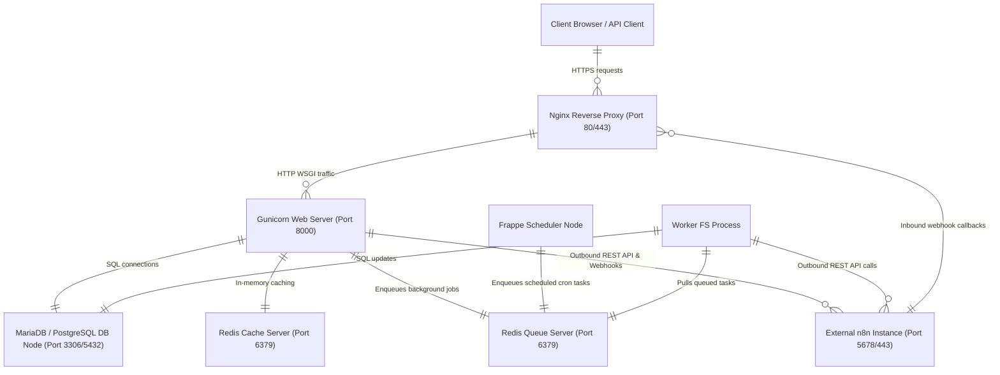

# 07 Deployment View

This chapter documents the deployment topology, network nodes, and runtime environment mapping for `frappe_n8n`.

## Infrastructure & Node Mapping

## Deployment Elements

### 1. Web Application Tier
- **Nginx**: Front-end proxy handling TLS termination and static asset serving.
- **Gunicorn**: WSGI app worker executing `frappe_n8n` request handlers, whitelisted endpoints, and public webhook callbacks.

### 2. Async Execution Tier
- **Worker FS**: Background worker process dedicated to executing enqueued long-running jobs (credential provisioning, workflow migration, playbook synchronization).
- **Scheduler**: Bench scheduler daemon executing periodic cron events (quarterly credential rotation and periodic playbook sync).

### 3. State & Queue Storage Tier
- **MariaDB / PostgreSQL**: Primary relational database storing site data, DocTypes, custom fields, and execution histories.
- **Redis Cache & Queue**: Dual Redis instances handling configuration/flag caching and RQ task queue management.

### 4. External Integration Target
- **n8n Instance**: Self-hosted or cloud n8n server accessible over HTTP/HTTPS (default port 5678 or standard 443).
