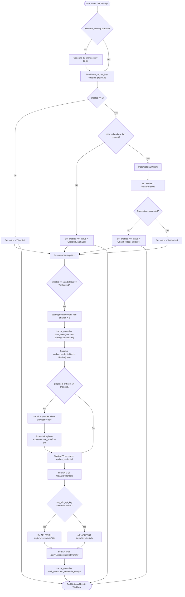

# 01: n8n Settings Update

This workflow models the behavior triggered when an administrator saves or updates the `n8n Settings` document.

```mermaid
flowchart TD
    Start([User saves n8n Settings]) --> ValSec{webhook_security present?}
    ValSec -- No --> GenSec[Generate 32-char security token] --> ReadConf
    ValSec -- Yes --> ReadConf[Read base_url, api_key, enabled, project_id]
    ReadConf --> IsEnabled{enabled == 1?}
    
    IsEnabled -- No --> SetDisabled[Set status = 'Disabled'] --> SaveDoc
    IsEnabled -- Yes --> CheckCreds{base_url and api_key present?}
    
    CheckCreds -- No --> DisableSetting[Set enabled = 0, status = 'Disabled', alert user] --> SaveDoc
    CheckCreds -- Yes --> InitClient[Instantiate N8nClient] --> ReqProj["n8n API GET /api/v1/projects"]
    
    ReqProj --> ProjOk{Connection successful?}
    ProjOk -- No --> SetUnauth[Set enabled = 0, status = 'Unauthorized', alert user] --> SaveDoc
    ProjOk -- Yes --> SetAuth[Set status = 'Authorized'] --> SaveDoc[Save n8n Settings Doc]
    
    SaveDoc --> CheckAuth{enabled == 1 and status == 'Authorized'?}
    CheckAuth -- Yes --> SyncProvider[Set Playbook Provider 'n8n' enabled = 1]
    SyncProvider --> EmitAuth["frappe_controller emit_event('doc:n8n Settings:authorized')"]
    EmitAuth --> EnqCred["Enqueue update_credential job in Redis Queue"]
    EnqCred --> CheckProj{project_id or base_url changed?}
    
    CheckProj -- Yes --> FetchPbs[Get all Playbooks where provider = 'n8n']
    FetchPbs --> LoopPbs[For each Playbook enqueue move_workflow job]
    LoopPbs --> WorkerExec["Worker FS consumes update_credential"]
    CheckProj -- No --> WorkerExec
    
    WorkerExec --> CallCreds["n8n API GET /api/v1/credentials"]
    CallCreds --> CredExists{crm_n8n_api_key credential exists?}
    CredExists -- Yes --> UpdateCred["n8n API PATCH /api/v1/credentials/{id}"]
    CredExists -- No --> CreateCred["n8n API POST /api/v1/credentials"]
    
    UpdateCred --> MoveCred["n8n API PUT /api/v1/credentials/{id}/transfer"]
    CreateCred --> MoveCred
    MoveCred --> EmitCredReady["frappe_controller emit_event('n8n_credential_ready')"]
    EmitCredReady --> End([End Settings Update Workflow])
    SetDisabled --> End
    DisableSetting --> End
    SetUnauth --> End
```
