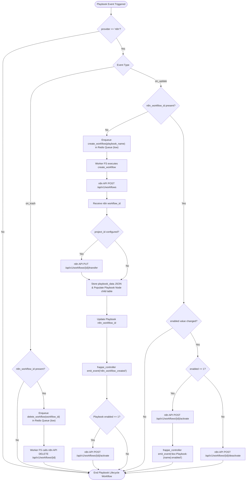

# 02: Playbook Document Lifecycle

This workflow models the behavior triggered when a `Playbook` document is created, updated, or deleted.

```mermaid
flowchart TD
    Start([Playbook Event Triggered]) --> CheckProv{provider == 'n8n'?}
    CheckProv -- No --> End([End Playbook Lifecycle Workflow])
    
    CheckProv -- Yes --> CheckEvent{Event Type}
    
    CheckEvent -- on_trash --> CheckWfTrash{n8n_workflow_id present?}
    CheckWfTrash -- No --> End
    CheckWfTrash -- Yes --> EnqDelete["Enqueue delete_workflow(workflow_id) in Redis Queue (low)"]
    EnqDelete --> WorkerDelete["Worker FS calls n8n API DELETE /api/v1/workflows/{id}"]
    WorkerDelete --> End
    
    CheckEvent -- on_update --> CheckWfExist{n8n_workflow_id present?}
    CheckWfExist -- No --> EnqCreate["Enqueue create_workflow(playbook_name) in Redis Queue (low)"]
    EnqCreate --> WorkerCreate["Worker FS executes create_workflow"]
    
    WorkerCreate --> CallCreateApi["n8n API POST /api/v1/workflows"]
    CallCreateApi --> GetWfId[Receive n8n workflow_id]
    GetWfId --> CheckProj{project_id configured?}
    CheckProj -- Yes --> CallMoveApi["n8n API PUT /api/v1/workflows/{id}/transfer"] --> StoreData
    CheckProj -- No --> StoreData
    
    StoreData[Store playbook_data JSON & Populate Playbook Node child table]
    StoreData --> SetWfId[Update Playbook n8n_workflow_id]
    SetWfId --> EmitWfCreated["frappe_controller emit_event('n8n_workflow_created')"]
    EmitWfCreated --> CheckEnabledAfterCreate{Playbook enabled == 1?}
    CheckEnabledAfterCreate -- Yes --> ActivateWf["n8n API POST /api/v1/workflows/{id}/activate"] --> End
    CheckEnabledAfterCreate -- No --> End
    
    CheckWfExist -- Yes --> CheckChanged{enabled value changed?}
    CheckChanged -- No --> End
    CheckChanged -- Yes --> IsEnabled{enabled == 1?}
    
    IsEnabled -- Yes --> CallActivate["n8n API POST /api/v1/workflows/{id}/activate"]
    CallActivate --> EmitEnabled["frappe_controller emit_event('doc:Playbook:{name}:enabled')"] --> End
    
    IsEnabled -- No --> CallDeactivate["n8n API POST /api/v1/workflows/{id}/deactivate"] --> End
```
