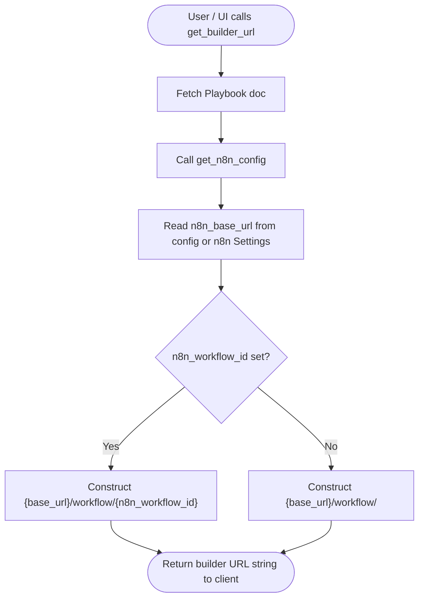

# 03: Playbook Builder URL Request

This workflow models the whitelisted endpoint execution when the user requests the n8n Workflow Editor URL for a Playbook.

```mermaid
flowchart TD
    Start([User / UI calls get_builder_url]) --> FetchPb[Fetch Playbook doc]
    FetchPb --> GetConfig[Call get_n8n_config]
    GetConfig --> ReadBase[Read n8n_base_url from config or n8n Settings]
    ReadBase --> CheckWfId{n8n_workflow_id set?}
    
    CheckWfId -- Yes --> FormatUrl["Construct {base_url}/workflow/{n8n_workflow_id}"]
    CheckWfId -- No --> FormatBase["Construct {base_url}/workflow/"]
    
    FormatUrl --> ReturnUrl([Return builder URL string to client])
    FormatBase --> ReturnUrl
```
