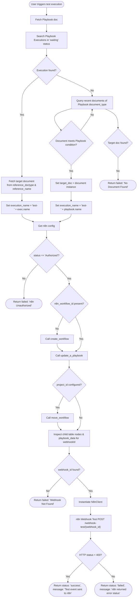

# 04: Playbook Test Execution

This workflow models the behavior triggered when a user clicks "Test Playbook" in the UI.

```mermaid
flowchart TD
    Start([User triggers test execution]) --> FetchPb[Fetch Playbook doc]
    FetchPb --> FindExec[Search Playbook Executions in 'waiting' status]
    
    FindExec --> FoundExec{Execution found?}
    FoundExec -- Yes --> TargetRefDoc[Fetch target document from reference_doctype & reference_name]
    TargetRefDoc --> SetExecName[Set execution_name = 'test-' + exec.name]
    
    FoundExec -- No --> SearchDoc[Query recent documents of Playbook document_type]
    SearchDoc --> CheckCond{Document meets Playbook condition?}
    CheckCond -- Yes --> SetTargetDoc[Set target_doc = document instance]
    SetTargetDoc --> SetPbExecName[Set execution_name = 'test-' + playbook.name]
    CheckCond -- No --> SearchDoc
    
    SearchDoc --> NoDoc{Target doc found?}
    NoDoc -- No --> FailNoDoc([Return failed: 'No Document Found'])
    
    SetExecName --> CheckConfig
    SetPbExecName --> CheckConfig
    
    CheckConfig[Get n8n config] --> CheckAuth{status == 'Authorized'?}
    CheckAuth -- No --> FailAuth([Return failed: 'n8n Unauthorized'])
    
    CheckAuth -- Yes --> EnsureWf{n8n_workflow_id present?}
    EnsureWf -- No --> CreateWf[Call create_workflow] --> UpdatePb
    EnsureWf -- Yes --> UpdatePb[Call update_a_playbook]
    
    UpdatePb --> CheckProj{project_id configured?}
    CheckProj -- Yes --> MoveWf[Call move_workflow] --> FindWebhook
    CheckProj -- No --> FindWebhook
    
    FindWebhook[Inspect child table nodes & playbook_data for webhookId] --> HasWebhook{webhook_id found?}
    HasWebhook -- No --> FailWebhook([Return failed: 'Webhook Not Found'])
    
    HasWebhook -- Yes --> InitClient[Instantiate N8nClient] --> SendTest["n8n Webhook Test POST /webhook-test/{webhook_id}"]
    
    SendTest --> ResOk{HTTP status < 400?}
    ResOk -- Yes --> SuccRes([Return status: 'success', message: 'Test event sent to n8n'])
    ResOk -- No --> FailRes([Return status: 'failed', message: 'n8n returned error status'])
```
