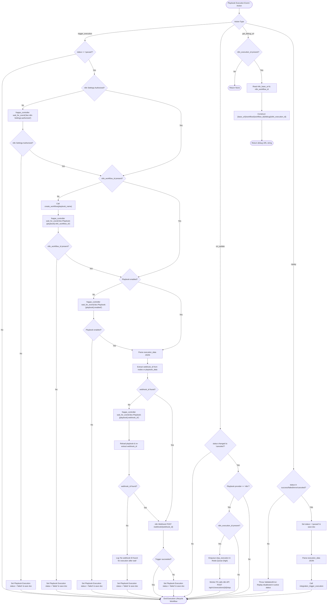

# 05: Playbook Execution Lifecycle

This workflow models the execution lifecycle including live execution triggering, dependency synchronization (waiting for authorization, workflow ID, activation, and webhook ID), cancellation/stopping, debug URL retrieval, and replaying.

