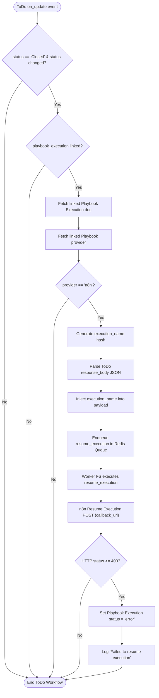

# 06: ToDo Task Completion

This workflow models the behavior triggered when a `ToDo` document status changes to "Closed", resuming a paused n8n execution via a webhook wait node callback.

```mermaid
flowchart TD
    Start([ToDo on_update event]) --> CheckClosed{status == 'Closed' & status changed?}
    CheckClosed -- No --> End([End ToDo Workflow])
    CheckClosed -- Yes --> CheckPbExec{playbook_execution linked?}
    CheckPbExec -- No --> End
    
    CheckPbExec -- Yes --> FetchPbExec[Fetch linked Playbook Execution doc]
    FetchPbExec --> FetchPb[Fetch linked Playbook provider]
    FetchPb --> IsN8n{provider == 'n8n'?}
    IsN8n -- No --> End
    
    IsN8n -- Yes --> GenName[Generate execution_name hash]
    GenName --> ParseResp[Parse ToDo response_body JSON]
    ParseResp --> SetExecName[Inject execution_name into payload]
    SetExecName --> EnqResume["Enqueue resume_execution in Redis Queue"]
    
    EnqResume --> WorkerResume["Worker FS executes resume_execution"]
    WorkerResume --> CallResume["n8n Resume Execution POST {callback_url}"]
    
    CallResume --> ResCheck{HTTP status >= 400?}
    ResCheck -- No --> End
    ResCheck -- Yes --> MarkError[Set Playbook Execution status = 'error']
    MarkError --> LogErr[Log 'Failed to resume execution'] --> End
```
