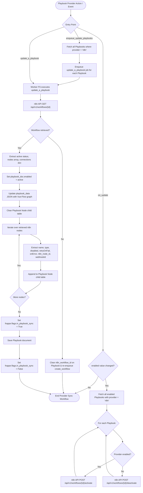

# 07: Playbook Provider Synchronization

This workflow models provider-level event handling and scheduled/manual playbook synchronization between n8n and Frappe.

```mermaid
flowchart TD
    Start([Playbook Provider Action / Event]) --> ActionType{Entry Point}
    
    ActionType -- on_update --> CheckChanged{enabled value changed?}
    CheckChanged -- No --> End([End Provider Sync Workflow])
    CheckChanged -- Yes --> FetchN8nPbs[Fetch all enabled Playbooks with provider = 'n8n']
    FetchN8nPbs --> LoopPbs{For each Playbook}
    LoopPbs --> IsEnabled{Provider enabled?}
    IsEnabled -- Yes --> CallEnable["n8n API POST /api/v1/workflows/{id}/activate"] --> LoopPbs
    IsEnabled -- No --> CallDisable["n8n API POST /api/v1/workflows/{id}/deactivate"] --> LoopPbs
    
    ActionType -- enqueue_update_playbooks --> FetchAllPbs[Fetch all Playbooks where provider = 'n8n']
    FetchAllPbs --> LoopEnq[Enqueue update_a_playbook job for each Playbook]
    LoopEnq --> WorkerExec["Worker FS executes update_a_playbook"]
    
    ActionType -- update_a_playbook --> WorkerExec
    
    WorkerExec --> FetchWf["n8n API GET /api/v1/workflows/{id}"]
    FetchWf --> WfFound{Workflow retrieved?}
    WfFound -- No --> ClearWfId[Clear n8n_workflow_id on Playbook & re-enqueue create_workflow] --> End
    WfFound -- Yes --> ParseWf[Extract active status, nodes array, connections dict]
    
    ParseWf --> SetActive[Set playbook_doc.enabled = active]
    SetActive --> SetVueData[Update playbook_data JSON with Vue-Flow graph]
    SetVueData --> ClearNodes[Clear Playbook Node child table]
    ClearNodes --> LoopNodes[Iterate over retrieved n8n nodes]
    
    LoopNodes --> MapNode[Extract name, type, disabled, retryOnFail, onError, n8n_node_id, webhookId]
    MapNode --> AppendNode[Append to Playbook Node child table]
    AppendNode --> MoreNodes{More nodes?}
    MoreNodes -- Yes --> LoopNodes
    
    MoreNodes -- No --> SetFlag[Set frappe.flags.in_playbook_sync = True]
    SetFlag --> SavePb[Save Playbook document]
    SavePb --> UnsetFlag[Set frappe.flags.in_playbook_sync = False] --> End
```
