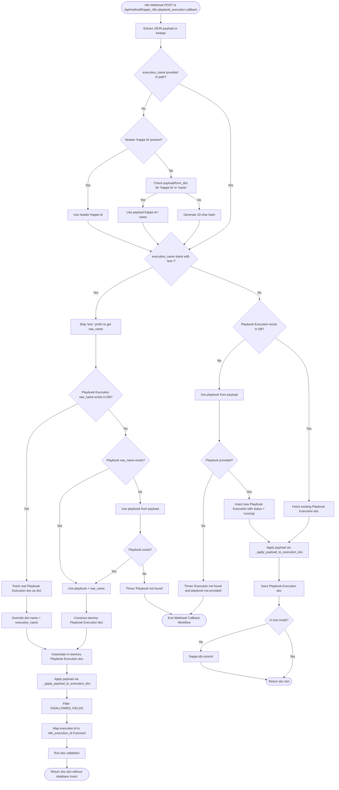

# 08: External Webhook Callback

This workflow models the whitelisted endpoint execution when n8n posts an execution callback payload to `/api/method/frappe_n8n.playbook_execution.callback`.

```mermaid
flowchart TD
    Start([n8n Webhook POST to /api/method/frappe_n8n.playbook_execution.callback]) --> ReadPayload[Extract JSON payload or kwargs]
    ReadPayload --> ResolveName{execution_name provided in path?}
    
    ResolveName -- No --> CheckHeader{Header 'frappe-id' present?}
    CheckHeader -- Yes --> SetFromHeader[Use header frappe-id] --> CheckTest
    CheckHeader -- No --> CheckBody[Check payload/form_dict for 'frappe-id' or 'name']
    CheckBody -- Yes --> SetFromBody[Use payload frappe-id / name] --> CheckTest
    CheckBody -- No --> GenHash[Generate 10-char hash] --> CheckTest
    
    ResolveName -- Yes --> CheckTest
    
    CheckTest{execution_name starts with 'test-'?}
    
    CheckTest -- Yes --> StripTest[Strip 'test-' prefix to get raw_name]
    StripTest --> TestDbExists{Playbook Execution raw_name exists in DB?}
    
    TestDbExists -- Yes --> GetRealDoc[Fetch real Playbook Execution doc as dict]
    GetRealDoc --> SetTestName[Override dict name = execution_name] --> InstTestDoc
    
    TestDbExists -- No --> CheckPbExists{Playbook raw_name exists?}
    CheckPbExists -- Yes --> SetPbName[Use playbook = raw_name] --> ConstructTestDict
    CheckPbExists -- No --> GetPbParam[Use playbook from payload]
    GetPbParam --> PbParamExists{Playbook exists?}
    PbParamExists -- No --> ThrowNoPb[Throw 'Playbook not found'] --> End([End Webhook Callback Workflow])
    PbParamExists -- Yes --> SetPbName
    
    ConstructTestDict[Construct dummy Playbook Execution dict] --> InstTestDoc[Instantiate in-memory Playbook Execution doc]
    InstTestDoc --> ApplyTestPayload["Apply payload via _apply_payload_to_execution_doc"]
    ApplyTestPayload --> FilterDisallowed[Filter DISALLOWED_FIELDS]
    FilterDisallowed --> MapExecId[Map execution.id to n8n_execution_id if present]
    MapExecId --> ValidateTest[Run doc validation]
    ValidateTest --> ReturnTestDoc([Return doc dict without database insert])
    
    CheckTest -- No --> ProdDbExists{Playbook Execution exists in DB?}
    ProdDbExists -- No --> GetPbProd[Get playbook from payload]
    GetPbProd --> PbProdExists{Playbook provided?}
    PbProdExists -- No --> ThrowNoPbExec[Throw 'Execution not found and playbook not provided'] --> End
    PbProdExists -- Yes --> CreateProdDoc[Insert new Playbook Execution with status = 'running'] --> ApplyProdPayload
    
    ProdDbExists -- Yes --> FetchProdDoc[Fetch existing Playbook Execution doc] --> ApplyProdPayload
    
    ApplyProdPayload["Apply payload via _apply_payload_to_execution_doc"]
    ApplyProdPayload --> SaveProdDoc[Save Playbook Execution doc]
    SaveProdDoc --> CheckTestFlag{In test mode?}
    CheckTestFlag -- No --> CommitDb[frappe.db.commit] --> ReturnProdDoc([Return doc dict])
    CheckTestFlag -- Yes --> ReturnProdDoc
```
