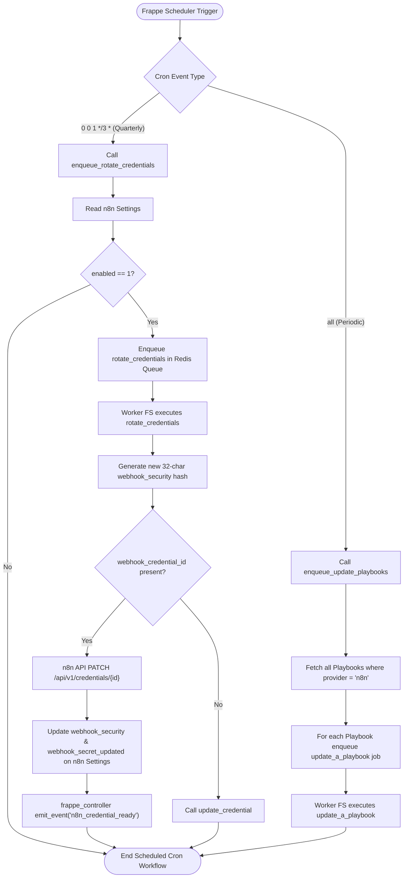

# 09: Scheduled Cron Events

This workflow models background execution triggered by Frappe Scheduler events.

```mermaid
flowchart TD
    Start([Frappe Scheduler Trigger]) --> CronType{Cron Event Type}
    
    CronType -- "0 0 1 */3 *" (Quarterly) --> CallEnqueueRotate[Call enqueue_rotate_credentials]
    CallEnqueueRotate --> ReadSettings[Read n8n Settings]
    ReadSettings --> IsEnabled{enabled == 1?}
    IsEnabled -- No --> End([End Scheduled Cron Workflow])
    IsEnabled -- Yes --> EnqRotate["Enqueue rotate_credentials in Redis Queue"]
    EnqRotate --> WorkerRotate["Worker FS executes rotate_credentials"]
    
    WorkerRotate --> GenSec[Generate new 32-char webhook_security hash]
    GenSec --> CheckCredId{webhook_credential_id present?}
    
    CheckCredId -- Yes --> PatchCred["n8n API PATCH /api/v1/credentials/{id}"]
    PatchCred --> SyncSettings[Update webhook_security & webhook_secret_updated on n8n Settings]
    SyncSettings --> EmitCredReady["frappe_controller emit_event('n8n_credential_ready')"] --> End
    
    CheckCredId -- No --> FallbackUpdate[Call update_credential] --> End
    
    CronType -- "all" (Periodic) --> CallEnqueueSync[Call enqueue_update_playbooks]
    CallEnqueueSync --> FetchPbs[Fetch all Playbooks where provider = 'n8n']
    FetchPbs --> LoopPbs[For each Playbook enqueue update_a_playbook job]
    LoopPbs --> WorkerSync["Worker FS executes update_a_playbook"]
    WorkerSync --> End
```
