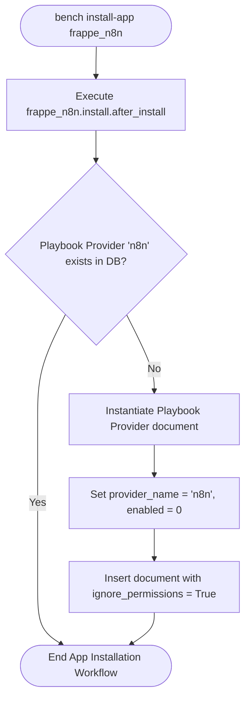

# 10: App Installation

This workflow models the execution triggered when `frappe_n8n` is installed on a site (`hooks.after_install`).

```mermaid
flowchart TD
    Start([bench install-app frappe_n8n]) --> ExecuteAfterInstall[Execute frappe_n8n.install.after_install]
    ExecuteAfterInstall --> CheckProvider{Playbook Provider 'n8n' exists in DB?}
    
    CheckProvider -- Yes --> End([End App Installation Workflow])
    CheckProvider -- No --> BuildProviderDoc[Instantiate Playbook Provider document]
    BuildProviderDoc --> SetAttributes[Set provider_name = 'n8n', enabled = 0]
    SetAttributes --> InsertDoc[Insert document with ignore_permissions = True]
    InsertDoc --> End
```
