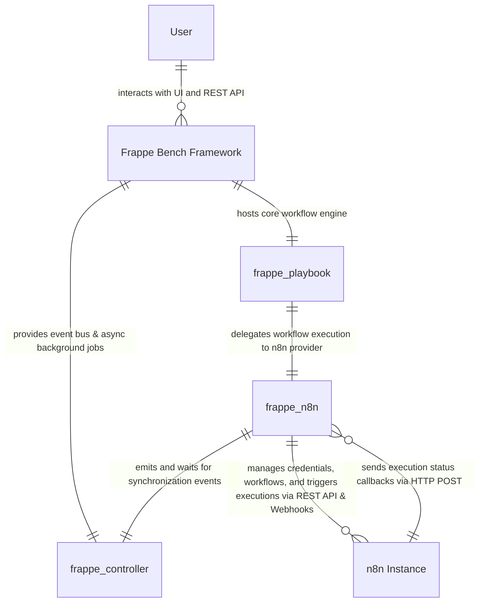

# C1 System Context ERD

The C1 System Context view defines the high-level boundary of the `frappe_n8n` app within the broader Frappe Bench ecosystem and its interactions with external systems and actors.

## Context Entities

### User
Human actor (System Manager, Administrator, or App User) who configures settings, designs playbooks, triggers test executions, and views execution logs.

### Frappe Bench Framework
The core web framework (WSGI/ASGI server, MariaDB/PostgreSQL database, Redis cache/queue, background workers) hosting Frappe applications.

### frappe_playbook
The core playbook orchestration framework providing generic `Playbook`, `Playbook Execution`, and `Playbook Provider` DocTypes.

### frappe_controller
Event emission and wait utility library (`frappe_controller.utils.controller`) used to synchronize async operations across Frappe Bench processes and background jobs.

### frappe_n8n
The n8n Provider Plugin for `frappe_playbook`. Translates Playbook lifecycle actions into n8n API calls and receives execution status callbacks from n8n.

### n8n Instance
External automation platform hosting workflow graphs, webhook triggers, execution runtime, and credential storage.
