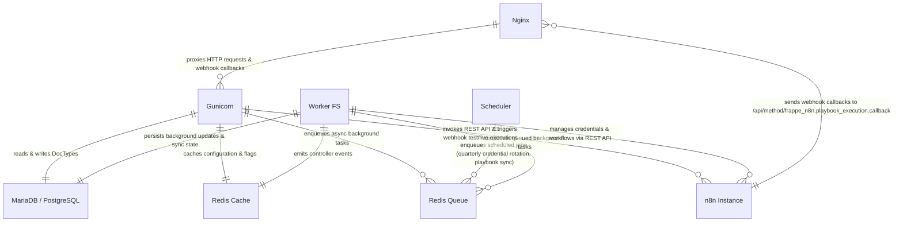

# C2 Container ERD

The C2 Container view illustrates the physical and runtime containers composing `frappe_n8n` within Frappe Bench, along with their database and queue relationships.

## Container Definitions

### Nginx
Reverse proxy and SSL termination layer routing public HTTP/HTTPS traffic to Gunicorn.

### Gunicorn
WSGI web application server processing synchronous HTTP requests, UI actions, whitelisted method overrides, and incoming webhook callbacks.

### MariaDB / PostgreSQL
Relational database storing all Frappe DocTypes and custom fields:
- `n8n Settings`
- `Playbook Provider`
- `Playbook`
- `Playbook Execution`
- `ToDo`
- `Custom Field`

### Redis Cache
In-memory key-value store used for session caching, document caching, and event synchronization via `frappe_controller`.

### Redis Queue
Queue manager for background job execution using RQ (Redis Queue).

### Worker FS
Background worker process consuming enqueued jobs (credential updates, workflow creation/transfer/deletion, playbook synchronization).

### Scheduler
Cron and periodic task scheduler triggering automated jobs at defined intervals.

### n8n Instance
External automation platform executing workflows and sending callback payloads back to Frappe.
