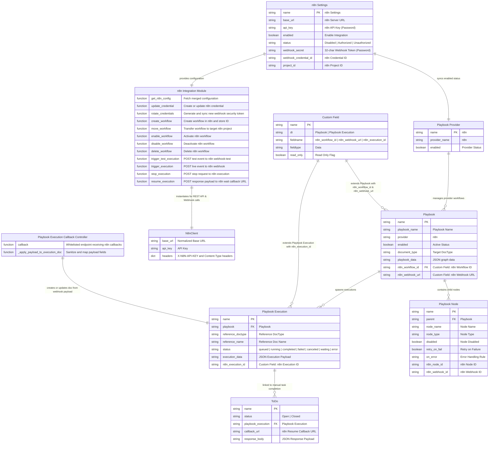

# C3 Component ERD

The C3 Component view details all internal DocTypes, Custom Fields, Python classes, integration modules, and data model attributes belonging to `frappe_n8n`.

## Component Details

### DocTypes
1. **`n8n Settings`**: Single DocType holding server URL, API key, authorization status, webhook security token, credential ID, and project ID.
2. **`Playbook Provider`**: Provider registration DocType in `frappe_playbook` with `name="n8n"`.
3. **`Playbook`**: Playbook definition DocType extended with `n8n_workflow_id` and `n8n_webhook_url`.
4. **`Playbook Node`**: Child table on `Playbook` capturing n8n node mappings and webhook IDs.
5. **`Playbook Execution`**: Execution instance DocType tracking status, payload, and `n8n_execution_id`.
6. **`ToDo`**: Standard Frappe task DocType hooked to resume waiting playbook executions upon task completion.

### Fixture Definitions
- **`Custom Field`**: Custom field fixtures exported in `frappe_n8n/fixtures/custom_field.json` attaching `n8n_workflow_id` and `n8n_webhook_url` to `Playbook` and `n8n_execution_id` to `Playbook Execution`.

### Python Modules & Classes
- **`frappe_n8n.integrations.n8n.N8nClient`**: HTTP client wrapping n8n REST API endpoints using `requests`.
- **`frappe_n8n.integrations.n8n`**: Main integration module containing workflow, credential, and execution helper functions.
- **`frappe_n8n.playbook_execution`**: Callback handler module containing the `@frappe.whitelist(allow_guest=True)` function `callback`.
