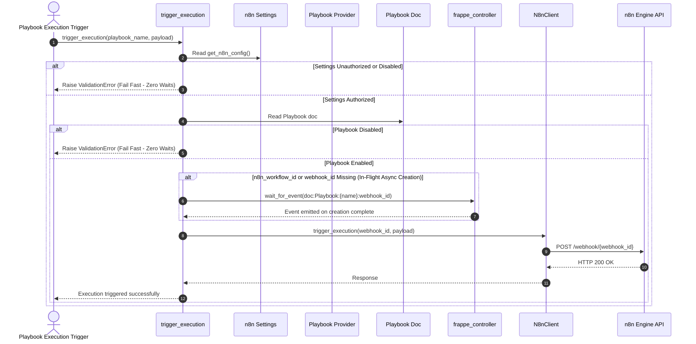
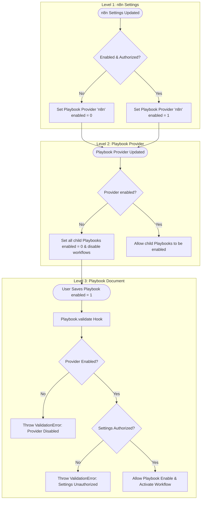
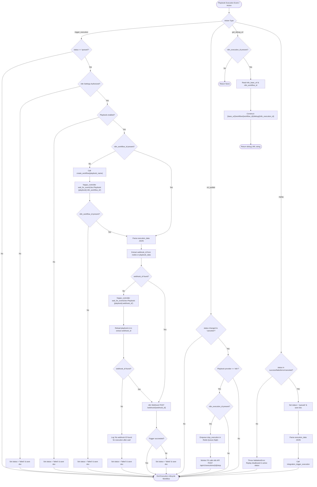

# Cascading Checks and Playbook Execution Wait Optimization Blueprint

## 1. Rule Compliance & Pattern Alignment

This blueprint establishes a cascading check model for `frappe_n8n` and eliminates redundant wait loops and synchronous API calls during playbook execution.

### Architectural Standards & Guidelines Compliance
- **Clean Architecture & SOLID Principles**:
  - **Single Responsibility Principle (SRP)**: Prerequisite validation (Settings authorized, Provider enabled, Workflow active) belongs to document lifecycle hooks (`validate`, `on_update`), not execution trigger dispatchers.
  - **Fail-Fast Principle**: Execution triggering must validate prerequisites synchronously and fail immediately with `frappe.ValidationError` if prerequisites are not met, rather than suspending background jobs on `wait_for_event` for missing configuration states.
- **Frappe Framework Conventions**:
  - Use `doc_events` in [`frappe_n8n/hooks.py`](frappe_n8n/hooks.py:40) to bind `validate` on `Playbook`.
  - Use `frappe.db.get_value` and `frappe.get_single` for efficient status queries.
  - Use `frappe.throw` / `frappe.ValidationError` for validation failures on document save.
- **Testing Standard**:
  - Adheres to standard `unittest` and `frappe` test runner practices with isolated DB state and clean mock setups.

---

## 2. Complete File & Directory Structure

```text
frappe_n8n/
├── hooks.py (M)
├── integrations/
│   └── n8n.py (M)
├── n8n/
│   └── doctype/
│       ├── n8n_settings/
│       │   └── n8n_settings.py (M)
│       ├── playbook/
│       │   └── playbook.py (M)
│       ├── playbook_execution/
│       │   └── playbook_execution.py (M)
│       └── playbook_provider/
│           └── playbook_provider.py (M)
└── tests/
    ├── integration/
    │   └── internal/
    │       └── n8n/
    │           ├── doctype/
    │           │   ├── n8n_settings/
    │           │   │   └── test_n8n_settings.py (M)
    │           │   ├── playbook/
    │           │   │   └── test_playbook.py (M)
    │           │   ├── playbook_execution/
    │           │   │   └── test_playbook_execution.py (M)
    │           │   └── playbook_provider/
    │           │       └── test_playbook_provider.py (M)
    │           └── test_playbook_lifecycle.py (M)
    └── unit/
        └── integrations/
            └── test_n8n.py (M)

docs/
└── architecture/
    ├── arc42/
    │   ├── 04-solution-strategy.md (M)
    │   ├── 08-cross-cutting-concepts.md (M)
    │   ├── 10-quality-requirements.md (M)
    │   └── 09-architecture-decisions/
    │       └── 0002-wait-for-webhook-id-and-execution-dependencies.md (M)
    └── bpmn/
        ├── 01-n8n-settings-update.md (M)
        ├── 02-playbook-lifecycle.md (M)
        ├── 05-playbook-execution-lifecycle.md (M)
        └── 07-playbook-provider-sync.md (M)
```

Legend:
- `(+)`: New File
- `(M)`: Modified File
- `(-)`: Deleted File

---

## 3. System-Wide Impact Analysis

### Affected Areas & Regression Prevention Strategies

1. **Playbook Enablement Validation (`Playbook.validate`)**:
   - *Current Behavior*: Playbooks can be saved with `enabled = 1` even if `n8n Settings` is unauthorized or `Playbook Provider` "n8n" is disabled.
   - *Cascading Strategy*: On `Playbook.validate`, if `provider == "n8n"` and `enabled == 1`, check `Playbook Provider` "n8n" `enabled` status and `n8n Settings` `status`. If either is disabled/unauthorized, raise `frappe.ValidationError` preventing doc save in enabled state.

2. **Cascading Disable on Settings/Provider Deactivation**:
   - *Current Behavior*: When `n8n Settings` becomes `Disabled` or `Unauthorized`, `Playbook Provider` "n8n" is updated to `enabled = 0`, but child `Playbook` records remain `enabled = 1` in the database.
   - *Cascading Strategy*:
     - When `n8n Settings` updates to `Disabled` or `Unauthorized`, update `Playbook Provider` "n8n" `enabled = 0`.
     - When `Playbook Provider` "n8n" updates to `enabled = 0`, iterate all associated `Playbook` records where `provider == "n8n"` and `enabled == 1`, and cascade set `enabled = 0` (and deactivate remote workflows if active).

3. **Execution Triggering Optimization (`trigger_execution`)**:
   - *Current Behavior*:
     - Synchronously calls `client.get_workflow(workflow_id)` and conditionally `client.activate_workflow(...)` on EVERY execution trigger.
     - Calls `controller.wait_for_event("doc:n8n Settings:n8n Settings:authorized")` if unauthorized.
     - Calls `controller.wait_for_event(f"doc:Playbook:{playbook_name}:enabled")` if disabled.
   - *Cascading Strategy*:
     - Eliminate synchronous `get_workflow` / `activate_workflow` calls in `trigger_execution`. Workflow activation state is maintained during Playbook enable/disable lifecycle.
     - Fail fast immediately with `frappe.ValidationError` if `n8n Settings` is unauthorized or `Playbook` is disabled (zero event waits for authorization or enablement during execution).
     - Retain `wait_for_event` only for async asset creation completion (`n8n_workflow_id` or `webhook_id` when workflow creation is in-flight in background worker).

---

## 4. File-by-File Logical Blueprint

### A. [`frappe_n8n/hooks.py`](frappe_n8n/hooks.py:40)
- **Purpose**: Register `validate` event hook for `Playbook`.
- **Dependencies**: None.
- **Exports/Hook Definitions**:
  - Add `"validate": "frappe_n8n.n8n.doctype.playbook.playbook.validate"` under `"Playbook"` in `doc_events`.

### B. [`frappe_n8n/n8n/doctype/playbook/playbook.py`](frappe_n8n/n8n/doctype/playbook/playbook.py:1)
- **Purpose**: Enforce cascading validation rules before saving Playbook.
- **Dependencies**: `frappe`, `frappe._`.
- **New Method Logic**: `validate(doc, method=None)`
  - Step 1: If `doc.provider != "n8n"` or `not doc.enabled`: return early.
  - Step 2: Fetch `enabled` status of `Playbook Provider` "n8n" via `frappe.db.get_value("Playbook Provider", "n8n", "enabled")`.
  - Step 3: If provider is not enabled, raise `frappe.ValidationError` with message: *"Cannot enable Playbook because the n8n Playbook Provider is disabled."*
  - Step 4: Fetch `n8n Settings` single doc (`settings = frappe.get_single("n8n Settings")`).
  - Step 5: If `not settings.enabled` or `settings.status != "Authorized"`, raise `frappe.ValidationError` with message: *"Cannot enable Playbook because n8n Settings are not authorized."*

### C. [`frappe_n8n/n8n/doctype/playbook_provider/playbook_provider.py`](frappe_n8n/n8n/doctype/playbook_provider/playbook_provider.py:16)
- **Purpose**: Cascade `enabled` status changes to child Playbooks.
- **Dependencies**: `frappe`, `integration_disable_workflow`, `integration_enable_workflow`.
- **Method Logic Modification**: `on_update(doc, method=None)`
  - Step 1: Check `doc.has_value_changed("enabled")`.
  - Step 2: If `doc.enabled == 0`:
    - Query all playbooks where `provider == "n8n"` and `enabled == 1`.
    - For each playbook:
      - Set `pb_doc.enabled = 0`.
      - Save `pb_doc` with `ignore_permissions=True`. (This inherently triggers `Playbook.on_update` which handles `integration_disable_workflow`).
  - Step 3: If `doc.enabled == 1`:
    - Query all playbooks where `provider == "n8n"` and `enabled == 1`.
    - For each playbook, call `integration_enable_workflow(pb_doc.name)`.

### D. [`frappe_n8n/n8n/doctype/n8n_settings/n8n_settings.py`](frappe_n8n/n8n/doctype/n8n_settings/n8n_settings.py:45)
- **Purpose**: Sync provider status and trigger cascading disable when settings become unauthorized/disabled.
- **Method Logic Modification**: `on_update(self)`
  - Step 1: Check if `Playbook Provider` "n8n" exists in DB.
  - Step 2: Calculate target provider enabled state: `target_enabled = 1 if (self.enabled and self.status == "Authorized") else 0`.
  - Step 3: Fetch provider doc `provider = frappe.get_doc("Playbook Provider", "n8n")`.
  - Step 4: If `provider.enabled != target_enabled`:
    - `provider.enabled = target_enabled`.
    - `provider.save(ignore_permissions=True)` (this triggers `Playbook Provider.on_update`, which cascades disable to child playbooks if target_enabled is 0).

### E. [`frappe_n8n/integrations/n8n.py`](frappe_n8n/integrations/n8n.py:550)
- **Purpose**: Optimize `trigger_execution` by removing redundant sync API calls and unnecessary wait loops.
- **Method Logic Modification**: `trigger_execution(playbook_name, payload, execution_name, webhook_id=None)`
  - Step 1: `config = get_n8n_config()`
  - Step 2: **Fail Fast on Settings**: If `config["status"] != "Authorized"` or `not config["enabled"]`:
    - Log error `"n8n Settings unauthorized for execution"`.
    - Raise `frappe.ValidationError("n8n Settings unauthorized")`. (No `wait_for_event` for settings authorization).
  - Step 3: Initialize client via `N8nClient.from_settings(wait_if_unauthorized=False)`. If client is None, raise `frappe.ValidationError("n8n Client initialization failed")`.
  - Step 4: Fetch `playbook_doc = frappe.get_doc("Playbook", playbook_name)`.
  - Step 5: **Fail Fast on Playbook Disabled**: If `not playbook_doc.enabled`:
    - Log error `"Playbook is disabled for execution"`.
    - Raise `frappe.ValidationError("Playbook is disabled")`. (No `wait_for_event` for playbook enabled state).
  - Step 6: **Resolve `n8n_workflow_id`**:
    - If `not playbook_doc.n8n_workflow_id`:
      - If `getattr(frappe.flags, "current_job_id", None)` is set, call `controller.wait_for_event(f"doc:Playbook:{playbook_name}:n8n_workflow_id")`; reload `playbook_doc`.
      - If still missing and `playbook_doc.provider == "n8n"`, call `create_workflow(playbook_name)`; reload `playbook_doc`.
      - If still missing, log error and raise `frappe.ValidationError("No workflow ID found for playbook execution")`.
  - Step 7: **REMOVE Synchronous `get_workflow` & `activate_workflow` Calls**:
    - Remove lines 578-590 completely. Active state is managed during Playbook enable/disable lifecycle events, not execution triggers.
  - Step 8: **Resolve `webhook_id`**:
    - `webhook_id = webhook_id or extract_webhook_id(playbook_doc)`
    - If missing and `getattr(frappe.flags, "current_job_id", None)` is set, call `controller.wait_for_event(f"doc:Playbook:{playbook_name}:webhook_id")`; reload `playbook_doc`; re-extract `webhook_id`.
    - If still missing, log error and raise `frappe.ValidationError("No webhook ID found for playbook execution")`.
  - Step 9: Call `client.trigger_execution(...)`.

---

## 5. Refactoring Plan

| Component / Function | Current State | Target Refactored State | Rationale / Impact |
|----------------------|---------------|-------------------------|--------------------|
| `Playbook` validation | No validation on `enabled` status | Added `validate` hook in `hooks.py` checking Provider enabled and Settings status | Prevents invalid enabled state in DB; enforces prerequisite hierarchy |
| `n8n_settings.on_update` | Sets `provider.enabled = self.enabled` | Sets `provider.enabled = 1 if (enabled and Authorized) else 0` | Ensures provider is disabled whenever settings are unauthorized |
| `playbook_provider.on_update` | Toggles workflow activation | Cascades `enabled = 0` to all child playbooks when provider disabled | Enforces cascading disable throughout the hierarchy |
| `trigger_execution` | Wait loops for `authorized` and `enabled`; sync GET/POST workflow activation API calls | Fail-fast on `unauthorized` or `disabled`; zero sync `get_workflow` API calls | Eliminates 100-300ms network latency per execution; removes redundant suspensions |

---

## 6. Comprehensive Testing Plan (MANDATORY)

### A. Unit Tests ([`frappe_n8n/tests/unit/integrations/test_n8n.py`](frappe_n8n/tests/unit/integrations/test_n8n.py:1))
1. **`test_trigger_execution_fails_fast_when_unauthorized`**:
   - Mock `get_n8n_config` returning `{"enabled": False, "status": "Unauthorized"}`.
   - Call `trigger_execution("pb-test", {}, "exec-1")`.
   - Assert `frappe.ValidationError` is raised immediately.
   - Assert `wait_for_event` is NOT called.
2. **`test_trigger_execution_fails_fast_when_playbook_disabled`**:
   - Mock authorized settings and client.
   - Mock `Playbook` doc with `enabled = 0`.
   - Call `trigger_execution("pb-disabled", {}, "exec-2")`.
   - Assert `frappe.ValidationError` is raised immediately.
   - Assert `wait_for_event` is NOT called for `doc:Playbook:pb-disabled:enabled`.
3. **`test_trigger_execution_does_not_call_get_workflow`**:
   - Mock enabled settings, enabled playbook, valid workflow_id and webhook_id.
   - Call `trigger_execution("pb-active", {}, "exec-3")`.
   - Assert `client.get_workflow` and `client.activate_workflow` were NOT called.
   - Assert `client.trigger_execution` WAS called with expected webhook_id and payload.

### B. Integration Tests
1. **Playbook Cascading Validation ([`frappe_n8n/tests/integration/internal/n8n/doctype/playbook/test_playbook.py`](frappe_n8n/tests/integration/internal/n8n/doctype/playbook/test_playbook.py:1))**:
   - Test 1: Save `Playbook` with `enabled = 1` when `Playbook Provider` "n8n" is `enabled = 0`. Assert `ValidationError` is thrown.
   - Test 2: Save `Playbook` with `enabled = 1` when `n8n Settings` is `status = "Unauthorized"`. Assert `ValidationError` is thrown.
   - Test 3: Save `Playbook` with `enabled = 1` when Provider is enabled AND Settings is Authorized. Assert save succeeds.
2. **Settings -> Provider -> Playbook Cascading Disable ([`frappe_n8n/tests/integration/internal/n8n/doctype/n8n_settings/test_n8n_settings.py`](frappe_n8n/tests/integration/internal/n8n/doctype/n8n_settings/test_n8n_settings.py:1))**:
   - Create enabled `n8n Settings`, `Playbook Provider`, and `Playbook`.
   - Update `n8n Settings` to `enabled = 0` or `status = "Unauthorized"`.
   - Reload `Playbook Provider` "n8n" and verify `enabled == 0`.
   - Reload `Playbook` and verify `enabled == 0`.
3. **Provider -> Playbook Cascading Disable ([`frappe_n8n/tests/integration/internal/n8n/doctype/playbook_provider/test_playbook_provider.py`](frappe_n8n/tests/integration/internal/n8n/doctype/playbook_provider/test_playbook_provider.py:1))**:
   - Set Provider `enabled = 1` and Playbook `enabled = 1`.
   - Update Provider `enabled = 0`.
   - Reload Playbook and verify `enabled == 0`.

---

## 7. Assets & Environment

- **Dependencies**: No external Python packages required.
- **Environment Variables**: N/A (uses Frappe site configuration and DocTypes).
- **Assets**: N/A.

---

## 8. Mermaid Diagrams

### Updated Playbook Execution Lifecycle Sequence Diagram



### Cascading Check & Disable Flow



### Updated BPMN 05 Flowchart ([`docs/architecture/bpmn/05-playbook-execution-lifecycle.md`](docs/architecture/bpmn/05-playbook-execution-lifecycle.md:1))


